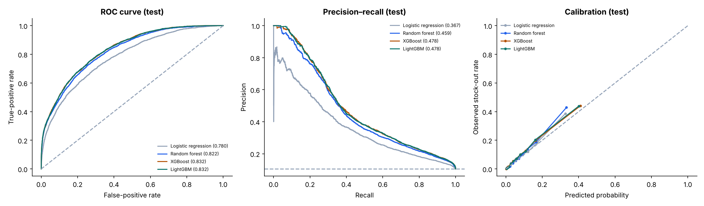
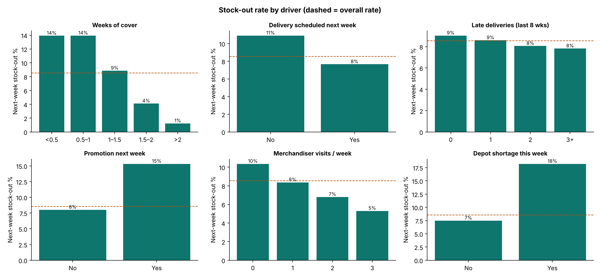
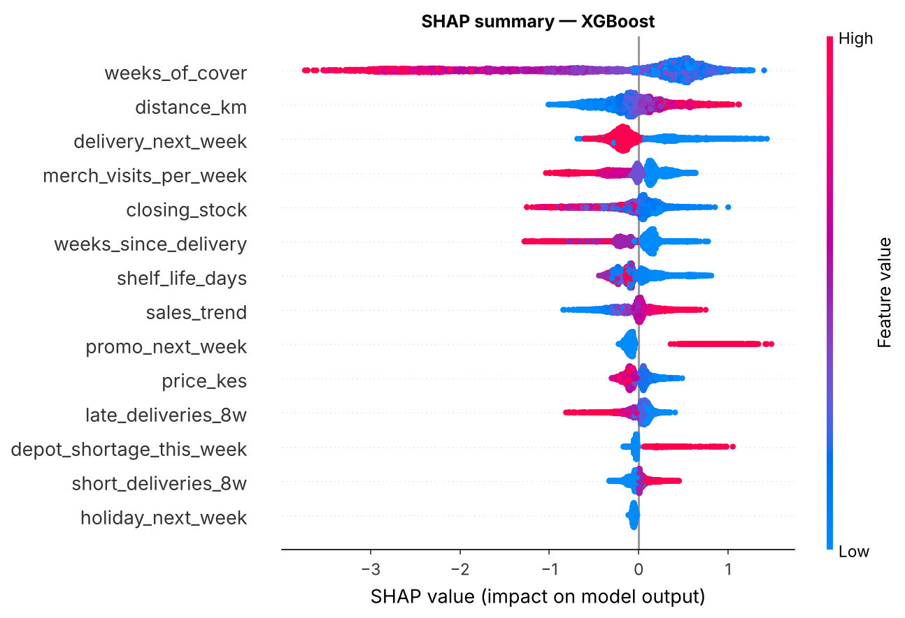
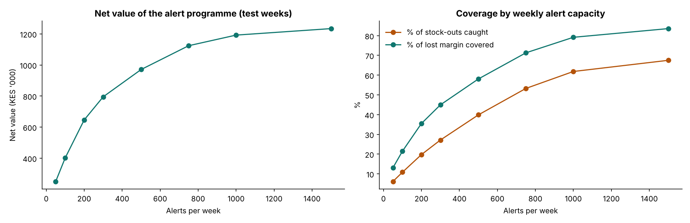

# Stock-out Prediction with Machine Learning → Airtable → Softr → AI briefing

Predicts **which outlet × SKU will run out of stock next week**, explains *why*, ranks alerts by money at risk, and delivers them to the field. The pipeline writes alerts to **Airtable**, the merchandisers' **Softr** portal reads them from there, and an **LLM** writes the managers' weekly briefing.

It is the predictive extension of **MerchTrack V2**, the field-force platform I architected, where real-time monitoring cut short-supply incidents to zero.

> **Data note:** the data is a **synthetic** weekly inventory panel (220 outlets × 15 dairy/deli SKUs × 60 weeks, ≈185k rows) simulated by [`data/generate_data.py`](data/generate_data.py). The simulation includes Poisson demand, promotions, holidays, order-up-to replenishment, depot shortages, late/short deliveries and merchandiser top-ups. No real company data is used.

| | |
|---|---|
| 📓 **Full walkthrough, every step explained** | [`python/stockout_prediction.ipynb`](python/stockout_prediction.ipynb) |
| 🧮 **Leakage-safe features** | [`python/features.py`](python/features.py) |
| 🔗 **Airtable sync** | [`integrations/airtable_sync.py`](integrations/airtable_sync.py) |
| 📱 **Softr portal design** | [`integrations/softr_portal.md`](integrations/softr_portal.md) |
| 🤖 **AI manager briefing** | [`integrations/ai_briefing.py`](integrations/ai_briefing.py) → [`outputs/ai_briefing.md`](outputs/ai_briefing.md) |

---

## 1. Why predict stock-outs?

An empty shelf loses the sale, the retailer's margin and the brand's visibility. Usually the competitor fills the gap. Reacting after the shelf is empty is too late. **Predicting it on Sunday night** gives the merchandiser or the van-sales team a week to act.

## 2. Pipeline

```
weekly inventory (stock, sales, deliveries, promo plan)
   └─► features at end of week t (only what's known on Sunday night)  ──►  label: stock-out in week t+1
         └─► 4 models · out-of-time split (train 33 wks / tune 8 wks / test 10 wks) · random-search tuning
               └─► SHAP explanations → reason codes
                     └─► expected-value ranking under team capacity (300 alerts/week)
                           └─► Airtable "Stock-out Alerts"  ──►  Softr field portal  ──►  "Actioned" feedback → retraining
                           └─► LLM briefing per region for sales managers
```

## 3. Results (10 untouched test weeks)

| Model | ROC-AUC | PR-AUC | Stock-outs caught by top 10% of alerts | Precision of top 10% |
|---|---:|---:|---:|---:|
| **XGBoost** | **0.832** | **0.478** | **42%** | **44%** |
| LightGBM | 0.832 | 0.478 | 42% | 44% |
| Random forest | 0.822 | 0.459 | 41% | 43% |
| Logistic regression | 0.780 | 0.367 | 37% | 39% |
| *No model (base rate)* | 0.500 | 0.105 | 10% | 10.5% |



Gradient boosting wins because the drivers **interact**: low cover is only dangerous when no delivery is coming, and a promotion only matters when stock is tight. A linear model can't capture that without hand-built interaction terms.

### What drives stock-outs?



| Driver | Next-week stock-out rate |
|---|---|
| Weeks of cover < 1 vs > 2 | **14%** vs 1% |
| Depot shortage this week | **18%** vs 7% |
| Promotion next week | **15%** vs 8% |
| No delivery scheduled next week | **11%** vs 8% |
| Merchandiser visits: 0 → 3 per week | 10% → **5%** |
| Past late deliveries (0 vs 3+) | 9% vs 8%, **not predictive** (a late delivery arrives next week) |

### Explainability (SHAP)



Every alert carries **reason codes** from its own SHAP values, for example: *"low weeks of cover; no delivery scheduled next week; low merchandiser coverage; far from depot"*.

### How many alerts? Expected value under capacity

Each outlet-SKU is scored as `P(stock-out) × 60% save rate × one week's margin − KES 50 action cost`, then ranked.

| Alerts per week | Stock-outs caught | Lost margin covered | Net value (10 weeks) |
|---:|---:|---:|---:|
| 100 | 11% | 21% | KES 0.40m |
| **300** | **27%** | **45%** | **KES 0.80m** |
| 500 | 40% | 58% | KES 0.97m |
| 1,000 | 62% | 79% | KES 1.19m |



Ranking by **value** rather than probability means 300 alerts cover **45% of lost margin** while catching 27% of stock-outs. The same 300 random checks would be worth only about **KES 54k**, about 15× less.

---

## 4. Airtable, Softr and AI — getting predictions to the field

| Component | What it does | How to run |
|---|---|---|
| **Airtable** (`airtable_sync.py`) | Upserts weekly alerts (risk, expected value, reasons, suggested action, status) into a *Stock-out Alerts* table via `pyairtable`, keyed on Alert ID so re-runs never duplicate | `AIRTABLE_TOKEN=… AIRTABLE_BASE_ID=… python integrations/airtable_sync.py` (without tokens it writes a dry-run payload to `outputs/airtable_payload.json`) |
| **Softr** (`softr_portal.md`) | Mobile portal: merchandisers see only *their* outlets' alerts and tap **Mark actioned**; managers see region dashboards and the briefing. The Status field feeds back into retraining | Design spec: pages, user groups, filters, feedback loop |
| **AI briefing** (`ai_briefing.py`) | Sends the alert table to **Claude** with a structured prompt and gets a plain-English briefing per region with the three most urgent actions | `ANTHROPIC_API_KEY=… python integrations/ai_briefing.py` (without a key it writes a template briefing in the same format) |

Sample briefing: [`outputs/ai_briefing.md`](outputs/ai_briefing.md) · Alert list: [`outputs/alerts_latest_week.csv`](outputs/alerts_latest_week.csv)

---

## 5. Where this is used

FMCG & retail out-of-stock prevention · pharmacy and essential-medicine stock-out early warning · e-commerce availability · manufacturing raw-material shortage risk · agro-dealer input availability · field-force visit prioritisation.

## 6. Limitations and next steps

- **Phantom stock** and recording errors in real inventory data.
- **Censored demand:** true demand during stock-outs is unobserved.
- **Feedback loop:** prevented stock-outs vanish from the data, so log actions (the Softr Status field) and model *uplift*.
- **Next:** probabilistic demand forecasts, optimal reorder quantities instead of alerts, and an A/B rollout to measure the real reduction.

## 7. Run it

```bash
pip install -r requirements.txt
python data/generate_data.py                       # optional: regenerate the simulation
python python/build_notebook.py
jupyter nbconvert --to notebook --execute --inplace --ExecutePreprocessor.timeout=1800 python/stockout_prediction.ipynb
```

```
stockout-prediction-ml/
├── data/           generate_data.py · outlets.csv · weekly_inventory.csv.gz
├── python/         features.py · build_notebook.py · stockout_prediction.ipynb
├── integrations/   airtable_sync.py · softr_portal.md · ai_briefing.py
└── outputs/        charts · test metrics · alert capacity table · alerts · Airtable payload · AI briefing
```

**Stack:** Python · pandas · scikit-learn · XGBoost · LightGBM · SHAP · pyairtable (Airtable API) · Softr · Anthropic Claude API
